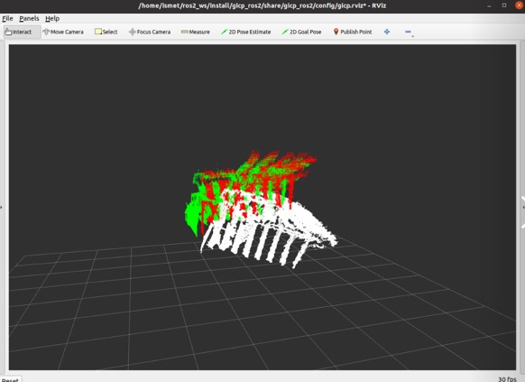
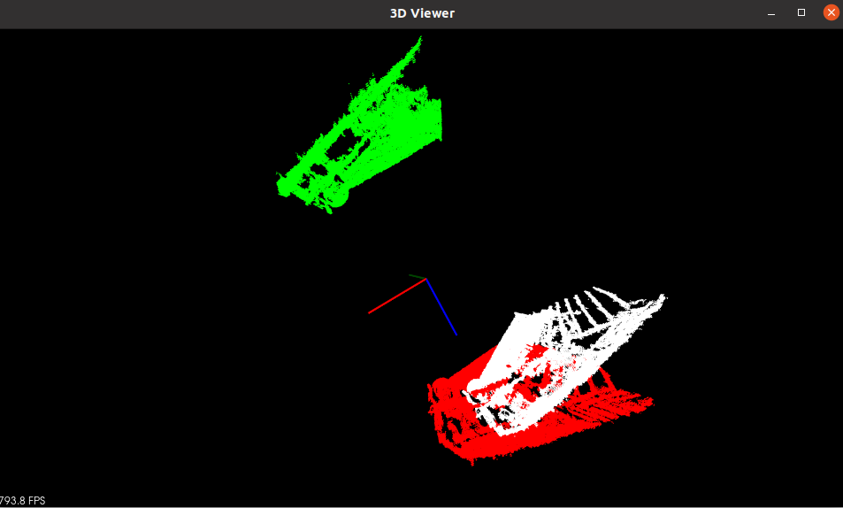

# gicp_ros2
Package that register two PointClouds with generalized iterative closest point (GICP) on ROS 2.

## Requirement and Build
You need  [PCL Library](https://pcl.readthedocs.io/projects/tutorials/en/master/) for process pointclouds.

Clone repository into your workspace.
```
cd ~/ros2_ws/src
git clone https://github.com/ismetatabay/gicp_ros2.git
```
build (ros2 terminal)
```
cd ~/ros2_ws
colcon build 
```
```
source ~/ros2_ws/install/setup.bash
```

## Visualize Pointclouds with Rviz2 (ROS2)
```
ros2 launch gicp_ros2 gicp_launch.py
```

White: Source (input) pointcloud.
Green: Targer pointcloud.
Red: Transformed pointcloud.

## Visualize Pointclouds with PCL Library
```
ros2 run gicp_ros2 viewer
```

White: Source (input) pointcloud.
Green: Targer pointcloud.
Red: Transformed pointcloud.
